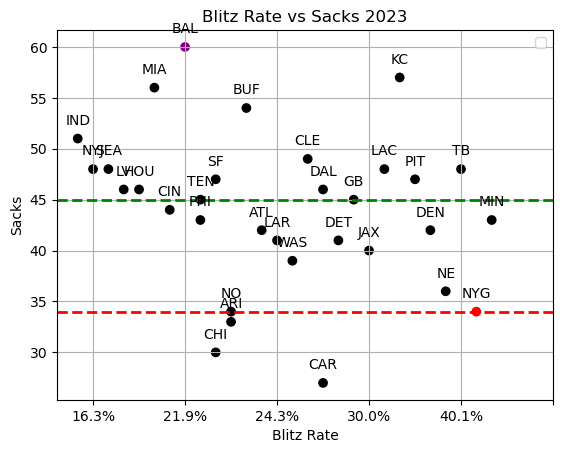

_Note:_ The code and the first iteration of this write-up was written _before_ this website was created, hence the publish date. I never published this project on any website, so I figured I could give it a home on my own website. You can find my first draft in the GitHub repo linked below, and you will notice the version on the repo will likely be somewhat different from this iteration of this post as I update it with new information we've discovered over the past six months.

---

Former Ravens and Giants defensive coordinator Wink Martindale is notorious for his high blitz rate. Theoretically, his defenses should consistently produce an inordinate amount of sacks. However, his defense in 2023 produced some of the least amount of sacks in the league. How is this possible? Is this an issue for Martindale's defenses specifically, or do other teams with high blitz rates also fail to get sacks? Are his defenses even effective? This project will look into the analytics of the effects of blitzing on defenses to answer the previous questions and find other conclusions.

If you want to see how I coded the visuals and processed the data, [check out my GitHub repo.](https://github.com/chue02/BlitzDefense/tree/main)

## Background

The 2017 Ravens defense was a formidable unit led by Dean Pees. Pees retired after that season and named Wink Martindale as his successor. Martindale continued their success, as Baltimore’s defenses statistically ranged from being good to elite until 2021.

In 2021, the Ravens’ struggled due to injuries and the defense had a noticeable statistical dip. [Martindale was subsequently dismissed, partially due to differences between him and Baltimore's head coach John Harbaugh.](https://www.espn.com/nfl/story/_/id/33118299/baltimore-ravens-fire-defensive-coordinator-don-martindale-source-says) He was then hired by the Giants for the 2022 season. The 2022 Giants was not an outstanding roster, but the team, including the defense, overperformed. He enjoyed success in New York that season, and when they played the Ravens, they won significantly due to a respectable defensive performance.

Unfortunately, the 2023 season for the Giants was not nearly as idyllic. Amidst the turmoil, fans frequently debated about why the team was so bad, and the defense was a particularly contentious talking point due to its mercurial nature.

In week 6, they allowed just 14 points against a Bill's offense averaged 26.5 pts/gm that season (6th in the league). Three weeks later, New York allowed 30 points from a Raiders team that averaged 19.5 pts/gm (23rd in the league). What made this even more embarrassing was this was the debut for the Raider's interim coach, former Giants linebacker Antonio Pierce, and their offense had not scored more than 21 points in any game before they played the Giants.

Some believed he was an asset due to their strong performances in several games. The six games the Giants won this year were largely due to the defense compensating for the team’s woeful offense, as the team was just 2-9 when allowing 20 or more points. Ultimately, Martindale left the team, [reportedly due to irreconcilable differences between him and head coach Brian Daboll.](https://www.espn.com/nfl/story/_/id/39276348/new-york-giants-wink-martindale-cursed-brian-daboll-firings)

Personally, I was upset when I heard he left. I believed Martindale's defenses could be improved and more consistent by adding additional talent on defense and having an offense that could sustain drives. However, there was a considerable amount of fans that were happy he left, as they believed his obstinate penchant for blitzing was a liability for the team. Moreover, they argued his success in Baltimore wasn't due to his scheming, but was because of him inheriting an elite defense.

I was curious about how effective his blitz-heavy defenses actually were. I created this project to analyze the effectiveness of blitz-heavy defenses. Is there even a correlation between blitz rate and defensive metrics? How did the Ravens defense perform after Martindale's departure? How has the Giants defense been performing with their new defensive coordinator, Shane Bowen, who has a substantially lower blitz rate than Martindale? Was Martindale's scheme actually holding back the team?

## Sack Exchange

In theory, if you blitz often you should get to the quarterback more often. Key phrase: _in theory._ As alluded to earlier, Martindale's defenses fails to produce sacks despite his frequent blitz rate. For instance, [OLB Matthew Judon](https://www.pro-football-reference.com/players/J/JudoMa00.htm) never had a double digit sack season until he left Baltimore, and after his departure to New England he immediately had two consecutive seasons of 12+ sacks. Unsurprisingly, this is where a lot of frustration with Martindale stems from. Does this argument hold based on the statistics, or is it a sentiment those biased against him profess?

### Baltimore

First, let’s look at this graph using data gathered from the 2018 NFL season:

|The number of sacks Wink Martindale's defense produced in 2018 (43)|
:-------------------------------:
||

Each team is represented by a black dot with the exception of `BAL`, which is in red, and `NYG`, which is in blue (go Big Blue). The green dashed line represents the median number of sacks produced by all teams that season, while the red dashed line represents the number of sacks Wink's team produced that year.

As you can tell, Wink’s defenses blitzed _often_. In fact Baltimore led the league in blitz rate in 2018, but they produced a respectable number of sacks. However, you can also notice Arizona and Pittsburgh had a similar blitz rate, yet they produced a few more sacks than Martindale. Furthermore, some teams rarely blitzed and produced a similar number of sacks, such as Detroit and San Francisco. Regardless, Wink’s defenses undoubtedly performed well in terms of getting sacks in 2018. Now let's examine Baltimore's performance of this metric in future years.

| Number of sacks Martindale produced in 2019 (37) | Number of sacks Martindale produced in 2020 (39) |
| :----------------------------------------------: | :----------------------------------------------: |
|                  |                  |

As you can see, the number of sacks generated is starting to become inconsistent. In 2019, the Ravens had a _below_ average number of sacks, although they managed to bounce up to being slightly above average in 2020. One thing did remain consistent: he led the league in blitz rate in both years.

You may have want to note that Baltimore's neighbors in blitz rate (i.e. Arizona, Pittsburgh, and Tampa Bay) both have similar blitzing frequencies in consecutive years, yet their sack production does not suffer the same inconsistency Baltimore did. Furthermore, you may also want to notice that in 2020, the blue `NYG` point is slightly above the red line.

|The number of sacks Wink Martindale's defense produced in 2021 (34)|
:-------------------------------:
||

This is the first graph where `BAL` is not the right-most point, as Wink eased up his blitzing and was “merely” in the top 10 for that rate. This anomaly might be attributed to him attempting to compensate for the Raven’s injuries and to play a less aggressive defensive style. Regardless, he was well below league average in sacks. Also, take a look at how successful Tampa Bay, Arizona, and Pittsburgh (who actually decreased their blitz rate) were in getting sacks.

After this year, Martindale divorced from Baltimore. Whether the disappointing number of sacks in relation to blitz rate contributed to his dismissal is currently unverified. Regardless, things weren't all bad for him, since he quickly managed to fill a vacant defensive coordinator job in a new NFL team and got to coach an exciting [5th overall rookie EDGE, Kayvon Thibodeaux.](https://www.pro-football-reference.com/players/T/ThibKa00.htm).

### New York

The New York Giants have a history of sacking quarterbacks, and Martindale's defensive mantra is to get after the quarterback. Ostensibly this was the perfect match. How did Wink do in his first year in New York?

|The number of sacks Wink Martindale's defense produced in 2022 (41)|
:-------------------------------:
||

The first thing you may notice is that I’ve changed `NYG` to be the red dot and the red dotted line to the number of sacks the Giants generated that year. You might notice the `BAL` dot is now purple. I figured it was important to highlight Baltimore's performance during and after Wink's tenure, as well as highlight how Wink has affected the Giants' defense.

The second thing you probably noticed was Baltimore’s blitz rate plummeted dramatically, yet they were well above league average in sacks. Additionally, New York’s blitz rate increased massively, blitzing from around the league average rate in 2021 to leading the league in 2022. Despite this, they were only marginally above league average in sacks.

How should one interpret this graph? Critics may cite the fact that Martindale has once again failed to produce a substantial number of sacks relative to his blitz rate. Furthermore, Thibodeaux only produced 4.5 sacks that year.

On the other hand, the Giants went from being below average in sacks created in 2021 to being slightly above average in this number. Thibodeaux wasn't a sack monster, but he showed lots of promise (e.g. that awesome Sunday Night Football game against the Commanders). It should also be worth noting that many other teams with large blitz rates also failed to produce many sacks, such as Arizona and Pittsburgh (who was reeling from a TJ Watt injury). Most importantly, the team was winning, and it's hard to not attribute at least _some_ of that success to Wink. I certainly did. I was excited to see what our coaches could do the next season. I might as well have been excited to be punched in the face.

|The number of sacks Wink Martindale's defense produced in 2023 (34)|
:-------------------------------:
||

In 2023 two things happened: the Giants went back to sucking, and Martindale's defenses went back to being below average in sacks. However, unlike in previous years where he would only 5 or less sacks below average, this year he was over 10 sacks below average. Note how far below the red line is below the green line compared to previous years.

Additionally, Baltimore thrived in producing sacks, generating more sacks that year than any year in Wink’s system. While Baltimore also blitzed well below average for the second consecutive year, Martindale was still blitzing at an inordinate rate just to be less successful than his old team. In two years Mike MacDonald (Wink’s replacement in Baltimore) managed to create two consecutive seasons of producing many sacks, something Wink never did over the course of six years.

It also didn't help that the defense as a whole didn't improve. Thibodeaux seemed to have regressed. While he did generate 11.5 sacks (the most any player has produced in Martindale's system), he was massively inconsistent and also underperformed in advanced metrics. He struggled to win pass rushes, although some attribute this to Martindale's tendency to make him play coverage to disguise his blitz packages.

To be fair to Martindale, there are a variety of compounding factors to consider. Firstly, the Giants were (and still are) significantly less talented than the Ravens. Secondly, as I alluded to before, the Giants did win games _because_ of their defense. You could argue Martindale's schemes won us those games. Thirdly, the NFL as a whole seemed to have adjusted to blitzes, not just the ones Martindale was creating.

Here is the correlation of each team's blitz rate vs the number of sacks they created:
|Year| 2018 | 2019 | 2020 | 2021 | 2022 | 2023 |
|----|----|----|----|----|----|----|
|Correlation| 0.181 |0.168 | 0.291 |0.271 |-0.051 |-0.187|

The correlation has always been pretty weak, but it seems to be trending towards negative since 2022. Have the leagues’ offenses adapted to punish high blitz rates? Perhaps. Should the Giants have given Martindale the benefit of the doubt and give him another year to adjust his scehems to adjust to these new trends? Perhaps, but unfortunately it's too late now, as Martindale essentially rage quit on the team because of his disuptes with Daboll. Additionally, several questions with Martindale still persists.

Why do Wink’s defenses seem to be successful every other year? Is it possible that in 2018 his defenses were exotic and cryptic? However, after having a year of film to study from, offenses were able to plan around his schemes and therefore reduced its effectiveness in 2019? Would Wink then adapt to the opposing offenses' adjustments, making him above average again in 2020, just for offenses to adjust again in 2021? Is there this vicious cycle of constant re-adjustment? Why do some other teams, such as Pittsburgh, have greater consistency in producing sacks without changing their blitz rate? Why did the Ravens defense enjoy greater consistency and production after Martindale left Baltimore? Is this coincidental or was his scheming a genuine detriment to his players’ production?

Martindale has stated [“pressure does break pipes”.](https://www.northjersey.com/story/sports/nfl/giants/2022/05/27/wink-martindales-ny-giants-defensive-coordinator-pressure/9926013002/) He argues the purpose of high blitzing isn’t to produce sacks, but to produce pressures. So, did Martindale consistently pressure the quarterback?

## Under Pressure

Like with the sacks produced metric, I measured blitz rate vs pressure rate and created similar graphs to the ones you've seen before. Instead of analyzing the graphs in sequences, I'm going to show all six graphs simultaneously. If you predicted inconsistent results, then you've predicted correctly.

At first glance, you can see that like his sack numbers, Wink’s pressure rates are also maddeningly inconsistent. In even numbered years, he will be well above league average, while in odd numbered years he will be middling to below average. I guess alternating levels of success between years _could_ be considered consistent. However, I'd prefer it if my defense was consistently above average ever year.

It should also be worth nothing that there are many other teams that have high pressure rates despite their low blitz rates. How do those teams manage to pressure the quarterback frequently while not needing to blitz often? Do they have elite pass rushers, is their secondary so good they can create pressures on man coverages, or is it a bit of both?

It should be worth noting that the Giants defense between 2022 and 2023 did not suffer from any major losses or departures in talent. In fact, you could argue the unit got more talented in 2023 due to additions such as linebacker Bobby Okereke, cornerback Deonte Banks (although to be fair he was a rookie then), and from other factors such as a full season from safety Xavier McKinney (yes I'm aware of how good he's been good in Green Bay). Additionally, Martindale also should have benefited from the development of players such as Thibodeaux, yet they were either stagnante or regressed. How much of their regression that should be contributed to Martindale directly is debatable, but ultimately it is his job as a coach to develop his players.

Now to give credit to Wink, Baltimore’s pressure rates did drop dramatically. In both 2022 and 2023, despite being well above average in sacks, the Ravens were below league average in producing pressures. Is this due to Baltimore’s strong secondary forcing longer plays, which therefore helps their pass rush produce sacks?

Did Martindale simply not have the right personnel he needed to practice his defensive philosophy as effectively? If that is the case, did he adjust his schemes to match the strengths of his players? [Reportedly, McKinney and Martindale were at odds with each other during the 2023 season due to disagreements in how McKinney should play.](https://www.espn.com/nfl/story/_/id/38856791/giants-wink-martindale-hurt-surprised-mckinney-criticism) Did Martindale's stubbornness in following his "pressure breaks pipes" dogma cost him his job when he was unable to deliver pressure and caused issues with his players?

| Year        | 2018  | 2019  | 2020  | 2021  | 2022  | 2023   |
| ----------- | ----- | ----- | ----- | ----- | ----- | ------ |
| Correlation | 0.104 | 0.065 | 0.331 | 0.456 | 0.148 | -0.028 |

This table is the correlation of pressure rate and blitz rate. Once again, the correlation is not very high, meaning constant blitzes does not equate to constant pressure for any team, especially in more recent years. However, Martindale's teams in particular seem to struggle to constantly produce pressure, whereas several other teams that practice heavy blitzing (TB, PIT, MIA) were able to consistently do so. For some teams, the data suggests heavy blitzing does produce the intended result of constant pressure. For some teams, the data shows heavy blitzing does not yield such results. For Wink, the data indicates the results of his heavy blitzes depends on if the year is odd or even.

Pressures and sacks only reflect a small fraction of a defense's ability to contain passing offenses. There is a more general metric that quantifies a team's passing offense efficiency: passer rating.

## Passer Rating

Like many other metrics, passer rating is far from a perfect measurement of passing offense. However, it’s still a useful quantity to summarize how good a defense is based on what passer rating they allow. I compared the ratings allowed vs the blitz rate, and once again, the results were inconclusive.

In this graph, the lower you are from the median, the better your defense is. As you can see, the average passer rating a defense allows is around 90. You can also see that Wink’s defenses typically allow a below average passer rating (i.e. his passing defenses are good). There are a couple of notable outliers, such as in 2021 when the Ravens were riddled with injuries.

In 2018 he allowed a passer rating in the low 80s, the best in the league other than the Bears. In 2019 his defense, which was basically average in terms of sacking and pressure the quarterback, actually improved their passer rating to be below 80. Zach Wilson’s passer rating in 2023 was in the high 70s, meaning when your quarterback played against the Ravens, they regressed to becoming Zach Wilson. However, in 2020, the rating allowed was in the high 80s, and while that was still below league average it is noticeably worse compared to 2018 and 2019.

In 2023, his defenses rebounded and the Giants’ passer rating allowed, on average, was quite low. Critics say this is a bit of a facade, as the defenses would contain quarterbacks such as Josh Allen and Jordan Love just to allow guys such as Aidan O'Connell, Derek Carr, and Joshua Dobbs to have career games. What’s particularly damning is that Baltimore’s 2023 passing defense allowed a lower rating (mid 70s) than Martindale achieved in any season as a DC. Also recall that the 2023 Ravens also had more sacks than Martindale ever did in any year.

How important is pressure for passing defenses? Does a higher pressure rate equate to a lower passer rating allowed? How correct is Martindale's theory that more pressures forces worse performances from opposing quarterbacks?

| Year        | 2018   | 2019   | 2020   | 2021   | 2022   | 2023   |
| ----------- | ------ | ------ | ------ | ------ | ------ | ------ |
| Correlation | -0.280 | -0.343 | -0.596 | -0.546 | -0.226 | -0.279 |

The table above is the correlation between passer rating and _pressure_ rate (so keep in mind this is not the _blitz_ rate correlation being calculated). A negative correlation is good for a defense, as this implies that the higher pressure rate a defenses creates, the lower the passer rating they allow. While the correlations aren't low, none of them are large enough to be considered significant. Does pressure break pipes, or is it just one of several ways to produce a strong passing defense?

## Points Allowed

Ultimately, the most important metric for any defense is the most obvious metric: points allowed. The ultimate goal for Martindale isn't to produce a prodigious number of sacks, pressures, etc. The ultimate goal is to allow as few points as possible. Is a high blitz rate a reliable way to produce to a successful defense?

| Year        | 2018  | 2019   | 2020   | 2021   | 2022  | 2023   |
| ----------- | ----- | ------ | ------ | ------ | ----- | ------ |
| Correlation | 0.018 | -0.018 | -0.355 | -0.136 | 0.129 | -0.010 |

The graphs shows two things: Wink is capable of creating good defenses, but blitz rate may not necessarily be the principle reason why his defenses were good when they were good. The correlations also support this idea, as there’s little to no association with blitzing and shutting down opposing offenses. The high blitz rate may help Wink create good defenses, but there are many other ways to create a defense that’s just as good if not better.

## Conclusion

Before analyzing the stats, I thought his departure was a big loss for the Giants. Now I miss him significantly less.

It should also be worth noting that Wink’s defenses requires many moving parts to work, as he needs his secondary to be elite in man coverage. It is true that any defense needs good players to be amazing, however, Martindale's system in particular is prone to error, as if there is a man that quickly gets open during a blitz, then offenses can make a huge play.

Martindale has two massive red flags as a coordinator. The first is that he cannot consistently showcase deliver on his philosophy that blitzing will constantlya nd consistently produce pressure. Some years he'll make quarterbacks miserable, while in other years opposing quarterbacks don’t face more or less pressure than average. The data also shows that some of his best years are the years where he has generates little pressure, such as in 2019. If his fundamental beliefs aren't consistent, then is it a wonder why his defenses also aren't consistent?

His second red flag is this: how much of his defensive success is actually due to his scheming or due to his personnel? When he first became a DC he inherited an already elite defense, and while he did not make them worse, he didn’t have to worry about covering as many deficiencies other coordinators on worse teams would have to. In general, the Giants defense didn't become significantly more or less successful compared to the years during and before Martindale's tenure in New York. You can even compare his defenses to the defenses from his old divisional rival, the Steelers. You can see that they also had a penchant for frequent blitzes, yet they were generally more statistically successful than the Ravens were.

So far this season, one could argue the Giants defense has improved under their new coordinator, Shane Bowen. [As of week 5, the Giants are ranked in the following metrics:](https://www.pro-football-reference.com/years/2024/opp.htm)

- **1st** in sacks produced (22)
- 17th in pressure rate
- 27th in passer rating
- **11th** in points allowed per game (20.8 pts/g)
- 9th in blitz rate

While the Giants defense is still far from being an elite unit (and this is merely a five game sample size), so far the Giants defense hasn't suffered dramatically from Martindale's departure.

So in essence: Wink Martindale’s defenses can be amazing, but they haven't necessarily proven to be sustainable or unique. His high risk, high reward scheming leads to unpredictability, but there are many other ways to produce a defense that’s just as good (if not better) as well as being more reliable. After this project, I realized Martindale's not as much of a mastermind coordinator I initially credited him to be. The 2023 Giants defense’s erratic nature hasn’t been an anomaly for Martindale, his defenses have always been unstable.

Considering the fact Daboll isn’t even the first head coach that disputed with Martindale over his philosophy, it seems his blitz-heavy defenses are not and should not be considered to be the most effective or reliable tactic available. While Martindale's contributions in New York were substantial and appreciated, his departure may be a net positive for the Giants, especially if Bowen improves upon his five-week start.
